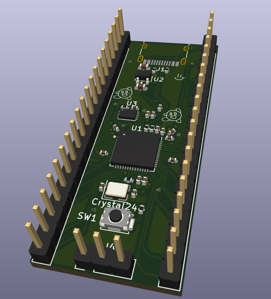
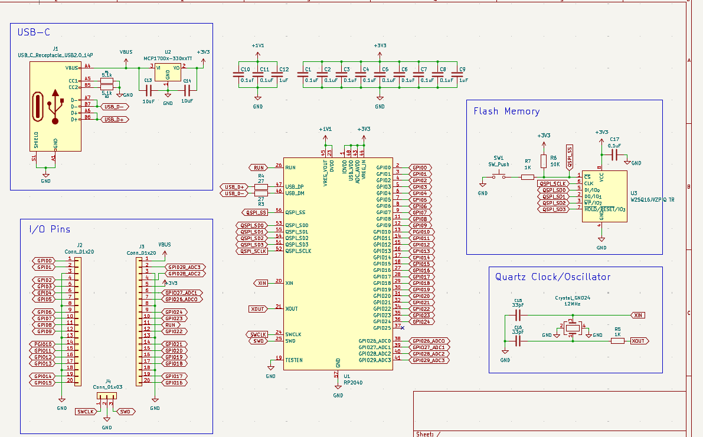
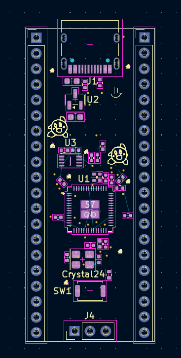

# DevBoard
I decided to follow along with HackClub's Devboard tutorial,  
made by Kai Pereira, to get more comfortable with designing PCBs.  
Here's what I ended up with:  

## PCB
Made in KiCAD  
Schematic:  

PCB:  

## BOM
1x [RP2040](https://www.pishop.us/product/raspberry-pi-rp2040/?src=raspberrypi) $1  
1x [PCB](https://cart.jlcpcb.com/quote?spm=Jlcpcb.Homepage.1006) from JLCPCB $2.10  
2x [33pF Capacitors](https://jlcpcb.com/partdetail/1914-0402CG330J500NT/C1562) $0.01  
11x [0.1uF Capacitors](https://jlcpcb.com/partdetail/1877-CL05B104KO5NNNC/C1525) $0.01  
2x [1uF Capacitors](https://jlcpcb.com/partdetail/15107-CL05A105KP5NNNC/C14445) $0.01  
2x [10uF Capacitors](https://jlcpcb.com/partdetail/2043-CL10A106MQ8NNNC/C1691) $0.01  
2x [27 Resistors](https://jlcpcb.com/partdetail/2358-RCMT08W270JT/C2006) $0.01  
2x [1K Resistors](https://jlcpcb.com/partdetail/12256-0402WGF1001TCE/C11702) $0.01  
2x [5.1K Resistors](https://jlcpcb.com/partdetail/26684-0402WGJ0512TCE/C25941) $0.01  
1x [10K Resistor](https://jlcpcb.com/partdetail/26274-0402WGJ0103TCE/C25531) $0.01  
1x [PinHeader1x03P2.54mm_Vertical](https://jlcpcb.com/partdetail/HanElectricity-2541WR03P/C5383096) $0.01  
2x [PinHeader1x20P2.54mm_Vertical](https://jlcpcb.com/partdetail/244951-2_54_1_20P/C247921) $0.23  
1x [4Pin 2x2.5mm Quartz Clock](https://jlcpcb.com/partdetail/YXC_CrystalOscillators-X322512MSB4SI/C9002) $0.06  
1x [USB-C Receptacle](https://jlcpcb.com/partdetail/Korean_HropartsElec-TYPE_C_31_M12/C165948) $0.17  
1x [TS-1088-AR02016 Push Button](https://jlcpcb.com/partdetail/XUNPU-TS_1088AR02016/C720477) $0.04  
1x [MCP1700x-330xxTT Fixed Voltage Regulator](https://jlcpcb.com/partdetail/JLCPCBAssembly-MCP1700/C9900006637) ~$0.0006 -> $0.01  
1x [W25Q16JVZPIQ TR Flash Mem Chip](https://jlcpcb.com/partdetail/WinbondElec-W25Q16JVZPIQ/C377853) $0.35  
Estimated Shipping: $2.40 (JLCPCB) + $6.44(PiShop)
Estimated Total: $12.89
